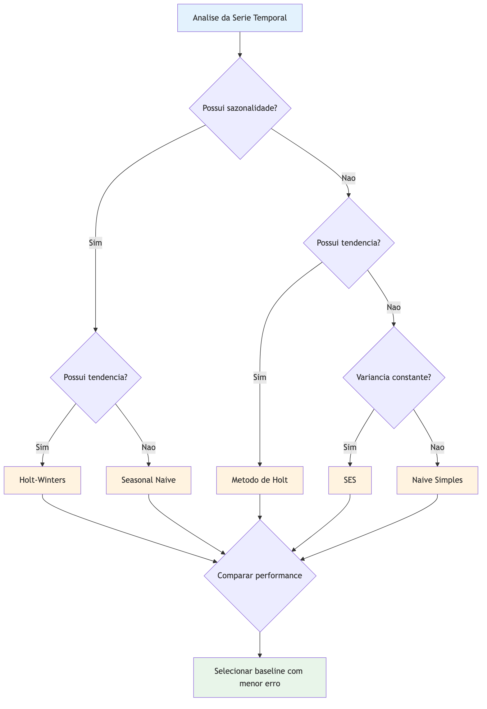

# Baselines Estatísticos Clássicos {#sec-cap03}

Imagine que você está prestes a prever a inflação brasileira para os próximos meses. A tentação imediata é recorrer a modelos sofisticados --- redes neurais profundas, *transformers* ou ensembles complexos. Afinal, se essas arquiteturas conquistaram campeonatos de previsão e desafios de *machine learning*, certamente serão superiores aos métodos antigos, não é? Surpreendentemente, a resposta frequentemente é não. Este capítulo apresenta os *baselines* estatísticos: modelos de referência que servem como o padrão mínimo de desempenho que qualquer técnica de Inteligência Artificial deve superar para justificar sua complexidade adicional.

::: {.callout-note}
## Leituras para aprofundamento
Este capítulo adota uma abordagem aplicada, didática e concisa, privilegiando intuição e uso prático. Para tratamento teórico aprofundado --- derivações rigorosas, propriedades assintóticas de estimadores, condições de identificação e testes de diagnóstico completos ---, recomenda-se consultar @box2015time, @hamilton1994time, @shumway2017time e @hyndman2021forecasting para o ferramental internacional, e @morettin2018analise, @bueno2011econometria e @enders2014applied para o tratamento em português e em contexto econométrico aplicado.
:::

## O Princípio da Parcimônia

A *Navalha de Ockham*, princípio filosófico formulado no século XIV por Guilherme de Ockham, orienta que, diante de duas explicações equivalentes, devemos preferir a mais simples [@thorburn1918myth]. Nas ciências aplicadas contemporâneas, essa máxima traduz-se em uma regra prática: não adicione complexidade sem ganho mensurável. Para o cientista social, economista ou atuário, essa orientação assume relevância particular por três razões fundamentais.

Primeiramente, considere a eficiência computacional. Modelos estatísticos clássicos treinam em segundos ou minutos, enquanto Deep Learning podem exigir horas de processamento em GPUs especializadas [@smyl2020hybrid]. Em ambientes de produção onde milhares de séries precisam ser previstas diariamente, essa diferença de escala determina a viabilidade operacional do sistema. Em um ambiente de negócios onde previsões precisam ser atualizadas diariamente — como na gestão de estoques de varejo ou no acompanhamento de indicadores macroeconômicos — essa diferença de tempo não é meramente técnica, mas operacionalmente crítica.

Em segundo lugar, a interpretabilidade frequentemente pesa mais que a precisão marginal. Quando um regulador questiona como uma instituição financeira calculou suas provisões técnicas, ou quando um tribunal avalia uma decisão baseada em previsões algorítmicas, explicar que "a rede neural aprendeu padrões não-lineares complexos" é insuficiente [@goodman2017european; @bratton2021machine]. Regulamentações como o Regulamento Geral de Proteção de Dados (GDPR) da União Europeia consagram o "direito à explicação" das decisões automatizadas. A capacidade de decompor uma previsão em seus componentes — tendência, sazonalidade e erro residual — oferece transparência regulatória e confiança institucional que modelos de caixa-preta não proporcionam.

Por fim, há o problema do sobreajuste (*overfitting*) em pequenas amostras. Séries temporais demográficas, como taxas de mortalidade por idade, ou indicadores macroeconômicos anuais, como o PIB, frequentemente compreendem apenas algumas dezenas de observações. Nesses cenários, modelos com milhões de parâmetros tendem a memorizar o ruído aleatório do passado em vez de capturar padrões generalizáveis, produzindo previsões para o futuro piores que estimativas ingênuas [@makridakis2018statistical; @cerqueira2019arima].

## Modelos Ingênuos: A Simplicidade como Padrão de Referência

Antes de aplicar qualquer técnica sofisticada, devemos estabelecer o mínimo esperado de desempenho. Os modelos ingênuos (*naive models*) oferecem exatamente isso: previsões tão simples que qualquer método elaborado deve superá-las substancialmente para merecer consideração [@hyndman2006another].

### O Ingênuo Simples (Naive)

O modelo mais elementar possível assume que o futuro será exatamente igual ao presente. Formalmente, a previsão para o horizonte $h$ é simplesmente o último valor observado:

$$\hat{y}_{t+h|t} = y_t$$

Embora pareça simplista demais, este modelo é surpreendentemente competitivo em séries que seguem um *passeio aleatório* (*random walk*). Considere o câmbio nominal brasileiro (R$/US$): estudos econométricos clássicos demonstram que as melhores previsões de curto prazo para taxas de câmbio flutuantes são, frequentemente, "amanhã será igual a hoje" [@meese1983empirical; @meese1983out]. A razão é que mudanças cambiais respondem a novas informações econômicas que, por definição, são imprevisíveis — se pudéssemos prevê-las, já estariam incorporadas na taxa atual.

### O Ingênuo Sazonal (Seasonal Naive)

Quando uma série exibe padrões sazonais regulares — como o fluxo de turistas em praias nordestinas, que picam nos meses de dezembro e janeiro — o modelo ingênuo simples falha sistematicamente. O *Seasonal Naive* corrige essa limitação assumindo que a previsão deve igualar o valor observado no mesmo período do ciclo anterior:

$$\hat{y}_{t+h|t} = y_{t+h-m(k+1)}$$

Nesta equação, $m$ representa o período sazonal (por exemplo, 12 para dados mensais com padrão anual) e $k$ é o número de ciclos completos decorridos no horizonte de previsão. Para prever as vendas de dezembro de 2025, usamos as vendas de dezembro de 2024; para janeiro de 2026, usamos janeiro de 2025, e assim por diante.

Este modelo é notavelmente difícil de superar em séries com sazonalidade estável. Imagine os pagamentos de benefícios previdenciários no Brasil: eles seguem um padrão anual previsível relacionado às datas de concessão e revisão, tornando o *Seasonal Naive* um competidor formidável para modelos mais complexos.

A @fig-baseline-selection apresenta um fluxo de decisão para seleção de baselines estatísticos com base nas características da série temporal.

{#fig-baseline-selection width=80%}

## Suavização Exponencial: Equilibrando Memória e Adaptação

Enquanto os modelos ingênuos usam apenas uma observação passada, a família de métodos de Suavização Exponencial (*Exponential Smoothing*) pondera o histórico completo da série, atribuindo pesos decrescentes à medida que os dados se tornam mais remotos. A intuição é que observações recentes geralmente contêm mais informação relevante para o futuro próximo do que dados antigos, mas o passado distante ainda oferece valor contextual.

### Suavização Exponencial Simples (SES)

Para séries sem tendência persistente ou sazonalidade clara — como o índice de confiança do consumidor em períodos de estabilidade macroeconômica — o SES mantém um "nível" atualizado da série através de uma média móvel ponderada:

$$\ell_t = \alpha y_t + (1 - \alpha) \ell_{t-1}$$

O parâmetro $\alpha$ (alfa), compreendido entre 0 e 1, controla a velocidade de adaptação. Um $\alpha$ próximo de 1 faz o modelo reagir rapidamente a novas observações, esquecendo rapidamente o passado — útil em ambientes voláteis. Um $\alpha$ próximo de 0 produz previsões estáveis e suavizadas, apropriadas para séries com ruído de medição significativo.

A escolha do $\alpha$ ótimo é feita tipicamente através de otimização numérica, minimizando o erro de previsão dentro da amostra. Em Python, a implementação do `statsmodels` realiza essa otimização automaticamente.

### Método de Holt-Winters: Capturando Tendência e Sazonalidade

Quando uma série apresenta tanto tendência (crescimento ou declínio sistemático ao longo do tempo) quanto sazonalidade (flutuações periódicas regulares), o método de Holt-Winters oferece uma extensão elegante do SES. Proposto por @holt2004forecasting e posteriormente estendido por Winters para capturar sazonalidade, este método mantém três componentes simultaneamente e continua sendo um dos benchmarks mais difíceis de superar em competições de previsão [@hyndman2008forecasting].

O **nível** ($\ell_t$) representa a baseline da série no tempo $t$, ajustada pela observação atual e pela tendência esperada. A **tendência** ($b_t$) captura a inclinação ou direção da série, atualizada conforme novos dados confirmam ou contradizem a trajetória anterior. A **sazonalidade** ($s_t$) registra o padrão cíclico, que pode ser modelado de forma aditiva (quando a amplitude da sazonalidade é constante) ou multiplicativa (quando a sazonalidade cresce proporcionalmente ao nível da série).

As equações de atualização são:

1.  **Nível:** $\ell_t = \alpha(y_t - s_{t-m}) + (1-\alpha)(\ell_{t-1} + b_{t-1})$
2.  **Tendência:** $b_t = \beta^*(\ell_t - \ell_{t-1}) + (1-\beta^*)b_{t-1}$
3.  **Sazonalidade:** $s_t = \gamma(y_t - \ell_{t-1} - b_{t-1}) + (1-\gamma)s_{t-m}$

Os parâmetros $\alpha$, $\beta^*$ e $\gamma$ são, respectivamente, os coeficientes de suavização para nível, tendência e sazonalidade. Quanto mais próximos de 1, mais rápido o modelo adapta-se a mudanças nos respectivos componentes.

A escolha entre sazonalidade aditiva e multiplicativa depende da natureza da série. No comércio varejista, picos sazonais de dezembro representam um aumento absoluto similar em anos de crise ou prosperidade (aditivo). No mercado de ações, volatilidade sazonal tende a escalar com o nível dos preços (multiplicativo).

## Modelos ARIMA: A Estatística Linear Clássica em Ação

Imagine que você está acompanhando o IPCA mês a mês. Você nota que quando a inflação sobe em outubro, ela tende a continuar elevada em novembro — e que um choque pontual, como um reajuste de combustíveis, ainda deixa rastro nos meses seguintes mesmo depois de absorvido. Como modelar essas duas forças ao mesmo tempo: a inércia dos valores passados e o eco dos choques recentes?

É exatamente para isso que servem os modelos **ARIMA** (*AutoRegressive Integrated Moving Average*). Desde a obra seminal de @box1976time — que estabeleceu o que hoje chamamos de "metodologia Box-Jenkins" —, os modelos ARIMA se tornaram o ponto de partida obrigatório na análise de séries temporais econômicas e demográficas.

A notação $ARIMA(p, d, q)$ identifica as ordens de cada um dos três componentes:

**AR — Autorregressivo (ordem $p$).** O nome diz tudo: a série se regride sobre si mesma. A ideia é que o valor de hoje pode ser explicado pelos $p$ valores anteriores. Se a inflação de um mês tende a correlacionar-se com a dos três meses anteriores, um componente AR(3) captura essa dependência:

$$y_t = c + \phi_1 y_{t-1} + \phi_2 y_{t-2} + \phi_3 y_{t-3} + \varepsilon_t$$

onde $\phi_1, \phi_2, \phi_3$ são os coeficientes autorregressivos e $\varepsilon_t$ é o erro aleatório no instante $t$.

**I — Integrado (ordem $d$).** Antes de estimar qualquer coisa, precisamos que a série seja *estacionária* — isto é, que sua média e variância não mudem ao longo do tempo. O PIB nominal brasileiro não é estacionário: ele cresce sistematicamente. A solução é *diferenciar* a série: em vez de modelar $y_t$, modelamos $\Delta y_t = y_t - y_{t-1}$ (a variação de um período para o outro). Se uma diferenciação é suficiente para estabilizar a série, dizemos que $d = 1$.

::: {.callout-note}
## Estacionariedade: por que isso importa?

Uma série é **estacionária** quando seus parâmetros estatísticos — média, variância e autocorrelações — permanecem constantes ao longo do tempo. Modelos ARIMA exigem estacionariedade para que suas estimativas sejam estáveis e interpretáveis. Na prática, testamos essa propriedade com testes formais como o ADF (*Augmented Dickey-Fuller*) e o KPSS antes de decidir quantas diferenciações aplicar.
:::

**MA — Média Móvel dos Erros (ordem $q$).** Choques aleatórios — uma crise cambial, um desastre natural, um decreto de emergência — não somem instantaneamente. O componente MA modela o quanto esses erros passados ainda influenciam o valor atual da série. Um $MA(1)$ significa que o erro de ontem ainda repercute hoje:

$$y_t = c + \varepsilon_t + \theta_1 \varepsilon_{t-1}$$

onde $\theta_1$ captura a intensidade com que o choque do período anterior persiste.

Reunindo os três componentes, um $ARIMA(1, 1, 1)$ é um modelo com um termo autorregressivo, uma diferenciação e um termo de média móvel — frequentemente um bom ponto de partida para séries econômicas moderadamente persistentes.

### Como identificar os parâmetros $(p, d, q)$?

A identificação segue um processo diagnóstico em três etapas:

1. **Determinar $d$:** verificar se a série é estacionária; se não for, diferenciá-la até que seja. Testes ADF e KPSS ajudam nessa decisão.
2. **Analisar FAC e FACP:** a *função de autocorrelação* (FAC) e a *função de autocorrelação parcial* (FACP) da série diferenciada revelam padrões característicos que sugerem os valores de $p$ e $q$ — picos que cortam abruptamente ou decaem gradualmente indicam estruturas AR ou MA.
3. **Comparar modelos candidatos:** ajustar alguns modelos plausíveis e selecionar aquele com menor critério de informação (AIC ou BIC), que penaliza modelos excessivamente complexos.

Embora mais trabalhosa que métodos automatizados como o `auto_arima`, essa abordagem diagnóstica constrói intuição sobre a estrutura da série — o que é valioso quando você precisa justificar suas escolhas para um regulador ou orientar uma equipe.

::: {.callout-tip}
## ARIMA na prática: use `AutoARIMA` para explorar, interprete para comunicar

A biblioteca `statsforecast` oferece um `AutoARIMA` eficiente que automatiza a busca pelos melhores $(p, d, q)$. Use-o para triagem rápida — mas ao apresentar resultados, sempre interprete o que cada componente significa na série que você está analisando.
:::

### Extensão sazonal: SARIMA

Quando a série exibe sazonalidade — como óbitos que aumentam sistematicamente no inverno, ou vendas que disparam em dezembro —, estendemos o modelo para **SARIMA** (*Seasonal ARIMA*), adicionando um bloco sazonal de parâmetros $(P, D, Q)_m$, onde $m$ é o período sazonal (por exemplo, $m = 12$ para dados mensais com padrão anual).

A notação completa $SARIMA(p, d, q)(P, D, Q)_m$ pode parecer intimidadora, mas a lógica é a mesma: o bloco $(p, d, q)$ cuida das dependências de curto prazo e o bloco $(P, D, Q)_m$ cuida das dependências que se repetem a cada $m$ períodos.

## Estudo de Caso: Previsão de Taxas de Mortalidade — Suécia (HMD)

Para ilustrar a aplicação prática dos *baselines* estatísticos, utilizaremos dados reais de mortalidade da **Human Mortality Database (HMD)** [@hmd2024] para a Suécia — o país com a série histórica mais longa disponível, iniciando em 1751. A taxa de mortalidade por idade e sexo é uma série crítica para cálculo de anuidades, reservas técnicas, fator previdenciário e projeções populacionais. A mesma metodologia se aplica diretamente às Tábuas Completas de Mortalidade do IBGE (ver @sec-datasets-mortality).

::: {.callout-note}
## Código completo no notebook

O notebook `cap03-baselines-estatisticos-solucoes.ipynb`, disponível na pasta `notebooks/` do repositório do livro, contém o código completo e executável deste estudo de caso — carregamento dos dados, implementação dos modelos, métricas e gráficos. Nesta seção apresentamos apenas os trechos centrais para ilustrar os conceitos.

**Dados:** arquivo `mortality_sweden.csv` (pasta `notebooks/`). Alternativas: pacote `pyhmfd` ou download manual em [mortality.org](https://www.mortality.org).
:::

### Carregamento e Preparação dos Dados

Vamos trabalhar com a taxa de mortalidade feminina na idade de 60 anos, período 1950–2020 — totalizando 71 observações anuais, um tamanho de amostra típico de séries demográficas. A coluna `Female` contém $q_x$ (probabilidade anual de morte); multiplicamos por 1 000 para trabalhar em ‰.

```python
# Configuração inicial e imports
import numpy as np
import pyhmfd
import sidrapy
from bcb import currency
import pandas as pd
import matplotlib.pyplot as plt
from scipy import stats
from statsmodels.tsa.holtwinters import ExponentialSmoothing
from statsmodels.tsa.api import SimpleExpSmoothing
from statsmodels.tsa.arima.model import ARIMA
from statsmodels.tsa.statespace.sarimax import SARIMAX
from statsmodels.tsa.seasonal import STL
from statsmodels.tsa.stattools import adfuller, acf, pacf
from statsmodels.stats.diagnostic import acorr_ljungbox
from statsmodels.graphics.tsaplots import plot_acf, plot_pacf
from sklearn.metrics import mean_absolute_error, mean_squared_error
import warnings
warnings.filterwarnings('ignore')

# Configuração de visualização
plt.style.use('seaborn-v0_8-whitegrid')
plt.rcParams['figure.figsize'] = (12, 6)

print("Ambiente configurado com sucesso!")

df_raw = pd.read_csv('https://raw.githubusercontent.com/filipeclduarte/book-adpst/refs/heads/main/data/mortality_sweden_1950.csv')

df = (
    df_raw[df_raw['Age'].eq(60) & df_raw['Year'].between(1950, 2020)]
    .rename(columns={'Female':'taxa_mortalidade'})
    .set_index('Year')['taxa_mortalidade']
)

df.index.name = 'ano'

display(df.head())
```

### Particionamento Temporal

Seguindo o protocolo do @sec-cap02, realizamos o particionamento temporal mantendo a ordem cronológica. Utilizaremos 80% para treino (1950–2005) e 20% para teste (2006–2020), resultando em 15 anos de previsão out-of-sample — um horizonte realisticamente desafiador para planejamento previdenciário.

### Análise estatística da série temporal


```python
print('Teste ADF para a série original:')
adf_test = adfuller(train, autolag='AIC')
print(f'ADF Statistic: {adf_test[0]:.2f}')
print(f'p-value: {adf_test[1]:.2f}')
if adf_test[1] > 0.05:
    print('A série original NÃO é estacionária. Diferenciando a série.')
    train_diff = train.diff().dropna()
else:
    print('A série original É estacionária. Usando a série original.')
    train_diff = train

# Fazer análise do acf e pacf da série diferenciada
fig, (ax1, ax2) = plt.subplots(2, 1, figsize=(12, 8), sharex=True)

plot_acf(train_diff, ax=ax1, lags=20, title='ACF da Série Diferenciada (ordem 1)')
ax1.set_ylabel('Autocorrelação')

plot_pacf(train_diff, ax=ax2, lags=20, title='PACF da Série Diferenciada (ordem 1)')
ax2.set_xlabel('Defasagem')
ax2.set_ylabel('Autocorrelação Parcial')

plt.tight_layout()
plt.show()
```

### Implementação dos Baselines

Agora implementamos os modelos ingênuos e de suavização exponencial. Para dados anuais sem sazonalidade intranual, o Seasonal Naive é equivalente ao Naive simples; o Holt-Winters sem componente sazonal reduz-se ao método de Holt com tendência.

```python

# Naive — último valor observado
naive_pred = np.full(len(test), train.iloc[-1])

# SES — suavização exponencial simples
ses_model = SimpleExpSmoothing(train)\
    .fit(optimized=True)
ses_pred_train = ses_model.fittedvalues
ses_pred = ses_model.forecast(len(test))

# Holt — tendência aditiva amortecida (correto para série anual sem sazonalidade)
holt_model = ExponentialSmoothing(
    train, trend='add', damped_trend=True
).fit(optimized=True)
holt_pred_train = holt_model.fittedvalues
holt_pred = holt_model.forecast(len(test))

# ARIMA(3,1,1) — passeio aleatório com estrutura AR e MA
arima_model = ARIMA(train, order=(3,1,1))\
    .fit()
arima_pred_train = arima_model.fittedvalues
arima_pred = arima_model.forecast(len(test))

# plot das previsões e o valor observado para treinamento
plt.figure(figsize=(12, 6))
plt.plot(train.index, train, 'g-', label='Treinamento')
plt.plot(train.index, ses_pred_train, 'm:', label='SES')
plt.plot(train.index, holt_pred_train, 'b-.', label='Holt')
plt.plot(train.index[3:], arima_pred_train.iloc[3:], 'k-', label='ARIMA') # Remove os primeiros 3 valores que são NaN (devido à ordem do ARIMA)
plt.xlabel('Data')
plt.ylabel('Valor')
plt.title('Logaritmo da taxa de mortalidade da idade 60 anos e previsão dos modelos estatísticos para o conjunto de treinamento')
plt.legend()
plt.grid(True, alpha=0.3)
plt.tight_layout()
plt.show()

# plot das previsões e o valor observado
plt.figure(figsize=(12, 6))
plt.plot(test.index, test, 'g-', label='Teste')
plt.plot(test.index, naive_pred, 'r--', label='Naive')
plt.plot(test.index, ses_pred, 'm:', label='SES')
plt.plot(test.index, holt_pred, 'b-.', label='Holt')
plt.plot(test.index, arima_pred, 'k-', label='ARIMA')
plt.xlabel('Data')
plt.ylabel('Valor')
plt.title('Logaritmo da taxa de mortalidade da idade 60 anos e previsão dos modelos estatísticos para o conjunto de teste')
plt.legend()
plt.grid(True, alpha=0.3)
plt.tight_layout()
plt.show()
```

### Avaliação das Métricas

Aplicamos as métricas MAE, RMSE e MASE para comparar os modelos, conforme protocolo estabelecido no @sec-cap02. A implementação do MASE escala o erro pelo desempenho do Naive, tornando o resultado interpretável independentemente da unidade da série.

```python
def mase(y_true, y_pred, y_train):
    mae_naive = np.mean(np.abs(np.diff(y_train)))   # erro do naive simples
    mae_model = np.mean(np.abs(y_true - y_pred))
    return mae_model / mae_naive

previsoes = {'Naive': naive_pred, 'SES': ses_pred,
             'Holt': holt_pred,   'ARIMA': arima_pred}

for nome, fc in previsoes.items():
    m = mase(test.values, np.asarray(fc),
             train.values)
    print(f"{nome:<8}  MASE = {m:.3f}")
```

### Visualização Comparativa

A visualização gráfica é essencial para diagnosticar onde cada modelo acerta ou falha sistematicamente. O código abaixo produz dois painéis: o superior compara as previsões dos quatro modelos contra os valores observados no período de teste 2006–2020, e o inferior mostra os erros de previsão ao longo do tempo.

```python
anos_teste = test.index

fig, (ax1, ax2) = plt.subplots(2, 1, figsize=(10, 7), sharex=True)

# Painel superior: previsões vs. observado
ax1.plot(df.index, df, 'k-', label='Observado', linewidth=1.5)
cores = {'Naive': '#e41a1c', 'SES': '#377eb8', 'Holt': '#4daf4a', 'ARIMA': '#984ea3'} # cor diferente para cada modelo
for nome, fc in previsoes.items():
    ax1.plot(anos_teste, np.asarray(fc), '--', color=cores[nome],
             label=nome, linewidth=1.2)
ax1.axvline(anos_teste[0], color='gray', linestyle=':', linewidth=1) # Linha vertical para destacar a separação dos dados
ax1.set_ylabel('Logaritmo da taxa de mortalidade')
ax1.legend(ncol=2, fontsize=9)

# Painel inferior: erros % de previsão 
for nome, fc in previsoes.items():
    erros = test.values - np.asarray(fc)
    ax2.plot(anos_teste, erros, '--', color=cores[nome], label=nome, linewidth=1.2)
ax2.axhline(0, color='black', linewidth=0.8)
ax2.set_ylabel('Erro de previsão (‰)')
ax2.set_xlabel('Ano')

plt.tight_layout()
plt.savefig('../images/fig-baselines-mortalidade.png', dpi=150, bbox_inches='tight') # salvar as figuras
plt.show()
```

### Validação Cruzada Temporal

Para uma avaliação mais robusta que não dependa de uma única partição, aplicamos validação cruzada com janela expansiva, conforme recomendado por @hyndman2021forecasting. A implementação abaixo itera sobre os pontos de corte, ajusta cada modelo e coleta o MASE por dobra.

```python
import pandas as pd

min_train = 20   # mínimo de observações para treino
horizon   = 5    # anos à frente avaliados em cada dobra
step      = 3    # avança 3 anos 

n = len(df)
resultados = []

for start in range(min_train, n - horizon, step):
    tr = df.iloc[:start]
    te = df.iloc[start:start + horizon]

    fc_naive = np.full(len(te), tr.iloc[-1])
    fc_ses   = SimpleExpSmoothing(tr).fit(optimized=True).forecast(len(te))
    fc_holt  = ExponentialSmoothing(tr, trend='add', damped_trend=True)\
                   .fit(optimized=True).forecast(len(te))
    fc_arima = ARIMA(tr, order=(1,1,1)).fit().forecast(len(te))

    for nome, fc in [('Naive', fc_naive), ('SES', fc_ses),
                     ('Holt', fc_holt), ('ARIMA', fc_arima)]:
        resultados.append({'modelo': nome, 'dobra': start,
                           'MASE': mase(te.values, np.asarray(fc), tr.values)})

cv_df = pd.DataFrame(resultados)
cv_summary = cv_df.groupby('modelo')['MASE'].agg(['mean', 'std'])
print(cv_summary.round(3))
```

O parâmetro `step=3` gera uma salto a cada 3 anos — suficiente para capturar a variabilidade de desempenho em séries demográficas sem custo computacional excessivo.

### Análise de Resíduos

A qualidade de um modelo não se mede apenas pelo erro médio, mas também pela estrutura de seus resíduos. Resíduos bem comportados devem ser aproximadamente normais, não autocorrelacionados e com variância constante. O teste de Ljung-Box verifica formalmente a hipótese de que não há autocorrelação nos resíduos até a defasagem $k$:

```python
from statsmodels.stats.diagnostic import acorr_ljungbox

# Holt
residuos = train.values - np.asarray(holt_pred_train)
lb = acorr_ljungbox(residuos, lags=5, return_df=True)

# p > 0.05: não há autocorrelação — resíduos se comportam como ruído branco
print('HOLT')
print(lb[['lb_stat', 'lb_pvalue']])
print('-'*25)

# Arima
residuos_arima = train.values - np.asarray(arima_pred_train)
lb_arima = acorr_ljungbox(residuos_arima, lags=5, return_df=True)

# p > 0.05: não há autocorrelação — resíduos se comportam como ruído branco
print('ARIMA')
print(lb_arima[['lb_stat', 'lb_pvalue']])

# Visualização dos resíduos
fig, (ax1, ax2) = plt.subplots(2, 1, figsize=(12, 8), sharex=True)
ax1.plot(residuos, 'k-', label='HOLT')
ax2.plot(residuos_arima[3:], 'r--', label='ARIMA')

ax1.set_ylabel('Resíduos')
ax1.legend(ncol=2, fontsize=9)
ax2.set_ylabel('Resíduos')
ax2.legend(ncol=2, fontsize=9)

plt.show()
```

Um diagnóstico completo inclui ainda histograma dos resíduos, Q-Q plot e gráfico de resíduos versus valores previstos — todos disponíveis no notebook.

### Lições do Estudo de Caso

Este exercício prático com dados de mortalidade brasileira ilustra três lições fundamentais que todo profissional deve internalizar:

**Primeira: o naive é um adversário formidável.** Nas séries de mortalidade da HMD, o modelo ingênuo simples frequentemente apresenta MASE próximo de 1.0, significando que métodos sofisticados precisam oferecer melhorias marginais consistentes para justificar sua complexidade. Não é incomum que Holt ou ARIMA produzam MASE entre 0.8 e 0.9 — uma melhoria de 10-20% que pode ou não justificar o esforço adicional, dependendo do contexto aplicado.

**Segunda: a validação cruzada temporal é essencial.** Uma única partição treino/teste pode ser enganosa por acaso. A janela expansiva fornece uma distribuição de erros que permite quantificar a variabilidade do desempenho e construir intervalos de confiança.

**Terceira: resíduos bem comportados são tão importantes quanto erros baixos.** Um modelo com MAE ligeiramente maior mas resíduos aproximadamente normais e não autocorrelacionados é preferível a um modelo com MAE menor mas resíduos estruturados, pois os intervalos de previsão do primeiro serão mais confiáveis.

O código completo deste estudo de caso, juntamente com o arquivo `mortality_sweden.csv`, está disponível no repositório do livro. O leitor pode replicar a análise com outros países da HMD — inclusive com os dados do Brasil via IBGE (Tábuas Completas de Mortalidade, SIDRA tabela 7362) ou do Sistema de Informações sobre Mortalidade do Ministério da Saúde.

## O Padrão de Ouro para Benchmarking

Ao longo das próximas partes deste livro, adotaremos uma regra de ouro consagrada pelas competições Makridakis (M-competitions): uma arquitetura neural — seja uma LSTM, N-BEATS, Transformer ou modelo híbrido — só será considerada válida se seu erro de previsão for estatística e economicamente inferior ao do *Seasonal Naive* ou de um SARIMA bem calibrado [@makridakis2020m4; @makridakis2022m5].

A justificativa é dupla. Primeiro, se um modelo complexo não consegue superar uma média móvel simples, sua complexidade adicional não está capturando padrões genuínos, mas provavelmente memorizando ruído. Segundo, em muitos domínios aplicados — especialmente em economia, finanças e demografia — os métodos apresentados neste capítulo não são meros *baselines* a serem superados, mas soluções de produção robustas e confiáveis.

Considere o caso da previsão de mortalidade para cálculo atuarial de previdência complementar: estudos comparativos sistemáticos demonstram que, para horizontes de 1 a 5 anos, métodos simples frequentemente igualam ou superam modelos neurais treinados em séries demográficas [@booth2008mortality; @hyndman2021forecasting]. A razão é que padrões de mortalidade são dominados por tendências de longo prazo e sazonalidade demográfica estável que métodos simples capturam eficientemente, enquanto modelos complexos *overfittam* flutuações estocásticas irrelevantes.

Em síntese, antes de embarcar na jornada das Deep Learning apresentadas nas próximas partes, domine os métodos deste capítulo. Eles não são obstáculos a serem ultrapassados, mas fundações a serem construídas. Quando uma rede neural genuinamente supera um SARIMA bem ajustado, essa superioridade é tanto mais significativa quanto mais difícil foi de alcançar.

## Exercícios Propostos

### Exercício 3.1
Utilizando os dados da Human Mortality Database para a Suécia, disponíveis no arquivo `notebooks/mortality_sweden.csv` do repositório do livro (ou via pacote `pyhmfd`, ou baixados diretamente em [mortality.org](https://www.mortality.org)), carregue as taxas de mortalidade da população total para a idade de 64 anos, período 1950–2020. Implemente os modelos Naive, Seasonal Naive e Holt-Winters. Calcule o MASE para cada modelo em previsões de 1 a 5 anos à frente. Qual modelo apresenta melhor desempenho? Por quê?

### Exercício 3.2 — Comparando Baselines para o IPCA com Validação Cruzada

#### Contexto

O IPCA (Índice Nacional de Preços ao Consumidor Amplo) é o índice oficial de inflação do Brasil,
medido mensalmente pelo IBGE desde 1980. Ele é a variável que o Banco Central do Brasil observa
para decidir se sobe ou reduz a taxa Selic, e é o índice usado para corrigir contratos de aluguel,
planos de saúde, aposentadorias pelo INSS e muitas obrigações contratuais. Prever o IPCA mensal é
uma tarefa presente em qualquer departamento de economia, tesouro corporativo ou consultoria
atuarial brasileira.

Neste exercício, você vai aplicar a metodologia de validação cruzada temporal com janela expansiva
— a mesma apresentada no estudo de caso deste capítulo — para comparar três modelos de previsão em
dados reais de inflação. Ao final, você será capaz de responder: *entre Naive, SES e ARIMA
automático, qual funciona melhor para prever o IPCA no próximo mês, e essa superioridade é
consistente ao longo do tempo ou depende do período?*

#### O que você vai entregar

Ao concluir o exercício, você deve ter produzido:

1. A série histórica do IPCA mensal (variação %) de janeiro de 2000 a dezembro de 2023 carregada
   em um `pandas.Series` com índice de datas mensais.
2. Uma função de validação cruzada com janela expansiva que ajusta os três modelos e coleta as
   métricas por dobra.
3. Uma tabela-resumo com MAE médio, RMSE médio e MASE médio para cada modelo.
4. Um gráfico de boxplot (ou violin plot) comparando a distribuição do MASE entre os modelos ao
   longo das dobras.
5. Um parágrafo curto interpretando os resultados: qual modelo escolheria? Por quê?

---

#### Passo 1 — Baixando os dados do IPCA via SIDRA/IBGE

O IBGE disponibiliza o IPCA na tabela **1737** do sistema SIDRA. A variável que nos interessa é a
**63**, que corresponde à variação percentual mensal (IPCA % a.m.) — o valor que aparece nos
noticiários como "o IPCA de março foi de 0,71%".

O pacote `sidrapy` (já instalado no ambiente do livro) permite acessar esses dados diretamente em
Python, sem download manual de planilhas:

```python
import sidrapy
import pandas as pd

# Baixa o IPCA mensal: tabela 1737, variável 63 (variação % mensal)
# Período: jan/2000 a dez/2023 (formato AAAAMM: 200001 a 202312)
raw = sidrapy.get_table(
    table_code="1737",
    territorial_level="1",   # Brasil (nível nacional)
    ibge_territorial_code="all",
    variable="63",
    period="200001-202312"
)

# As primeiras linhas do retorno são cabeçalho — pulamos com iloc[1:]
# A coluna "V" contém os valores; convertemos para numérico
ipca = (
    raw.iloc[1:]
       .assign(data=lambda df: pd.to_datetime(df["D2C"], format="%Y%m"))
       .set_index("data")["V"]
       .astype(float)
       .rename("ipca_pct")
)

print(f"Observações: {len(ipca)}")  # Deve ser 288 (24 anos × 12 meses)
print(ipca.head())
```

::: {.callout-tip}
## Por que variável 63 e não 69?

A tabela 1737 tem várias variáveis: 63 é a variação **mensal** (ex.: 0,71% em março); 69 é a
variação **acumulada no ano** (ex.: 1,42% acumulado até março). Para previsão de séries
temporais, trabalhamos com a variação mensal — ela é estacionária após períodos de crise
e mantém a frequência adequada para modelos ARIMA.
:::

---

#### Passo 2 — Entendendo a validação cruzada com janela expansiva

Na @sec-cap02, discutimos por que não podemos embaralhar os dados em séries temporais como se faz
em machine learning supervisionado clássico: o futuro não pode vazar para o treino. A **validação
cruzada com janela expansiva** resolve isso criando múltiplas partições respeitando a ordem
cronológica: a cada dobra, a janela de treino cresce em `step` observações, e o modelo é avaliado
nas próximas `horizon` observações.

O mesmo padrão já foi implementado no estudo de caso deste capítulo (seção "Validação Cruzada
Temporal"). Adapte-o para o IPCA definindo os seguintes parâmetros de partida:

- `min_train = 36` — mínimo de 36 meses (3 anos) para estimar o primeiro modelo
- `horizon = 6` — avalia a previsão dos próximos 6 meses em cada dobra
- `step = 3` — avança 3 meses a cada dobra (sem reusar as mesmas observações de teste)

Com 288 observações e esses parâmetros, você obterá aproximadamente 83 dobras — uma distribuição
de erros estatisticamente robusta.

---

#### Passo 3 — Os três modelos

**Naive**: a previsão para os próximos `horizon` meses é simplesmente o último valor observado no
treino. É o modelo mais simples possível e serve como piso de comparação: qualquer método que não
supere o Naive não tem utilidade prática.

**SES (Suavização Exponencial Simples)**: pondera o histórico com pesos exponencialmente
decrescentes. O parâmetro $\alpha$ é otimizado automaticamente; use `optimized=True` da
implementação do `statsmodels`. Adequado para séries sem tendência dominante — o que, para o
IPCA mensal em um período longo, tende a ser razoável.

**ARIMA automático**: em vez de identificar manualmente os parâmetros $(p, d, q)$ via FAC e
FACP — o processo diagnóstico descrito na seção anterior deste capítulo —, o `AutoARIMA` da
biblioteca `statsforecast` testa combinações de parâmetros e seleciona o modelo com menor AIC
automaticamente. Instale se necessário:

```python
# Execute no terminal ou em uma célula do notebook (apenas uma vez)
# pip install statsforecast
```

```python
import numpy as np
from statsmodels.tsa.api import SimpleExpSmoothing
from statsmodels.tsa.arima.model import ARIMA
from statsforecast import StatsForecast
from statsforecast.models import AutoARIMA
import warnings
warnings.filterwarnings("ignore")

# Reutilize a função mase() do estudo de caso deste capítulo
def mase(y_true, y_pred, y_train):
    """MASE: erro do modelo escalado pelo erro do naive."""
    mae_naive = np.mean(np.abs(np.diff(y_train)))
    mae_model = np.mean(np.abs(y_true - y_pred))
    return mae_model / mae_naive

def rmse(y_true, y_pred):
    return np.sqrt(np.mean((y_true - y_pred) ** 2))

# --- Loop de validação cruzada ---
min_train = 36
horizon   = 6
step      = 3

resultados = []

for start in range(min_train, len(ipca) - horizon, step):
    tr = ipca.iloc[:start]          # janela de treino (cresce a cada dobra)
    te = ipca.iloc[start:start + horizon]  # janela de teste

    # Naive: repete o último valor observado
    fc_naive = np.full(len(te), tr.iloc[-1])

    # SES: parâmetro alpha otimizado automaticamente
    fc_ses = (
        SimpleExpSmoothing(tr)
        .fit(optimized=True)
        .forecast(len(te))
        .values
    )

    # AutoARIMA: seleciona (p,d,q) automaticamente por AIC
    # O statsforecast espera um DataFrame com colunas 'unique_id', 'ds', 'y'
    df_sf = pd.DataFrame({
        "unique_id": "IPCA",
        "ds": tr.index,
        "y": tr.values
    })
    sf = StatsForecast(models=[AutoARIMA(season_length=12)], freq="MS")
    sf.fit(df_sf)
    fc_arima = sf.predict(h=len(te))["AutoARIMA"].values

    for nome, fc in [("Naive", fc_naive), ("SES", fc_ses), ("AutoARIMA", fc_arima)]:
        resultados.append({
            "modelo": nome,
            "dobra":  start,
            "MAE":    np.mean(np.abs(te.values - fc)),
            "RMSE":   rmse(te.values, fc),
            "MASE":   mase(te.values, fc, tr.values),
        })

cv_df = pd.DataFrame(resultados)
```

::: {.callout-warning}
## AutoARIMA pode ser lento em muitas dobras

Com 80+ dobras, o loop pode levar alguns minutos porque o AutoARIMA reestima o modelo do zero
em cada dobra. Se o tempo for um problema, você pode reduzir o número de dobras aumentando
`step` para 6 ou 12, ou usar um ARIMA de ordem fixa — por exemplo, `ARIMA(tr, order=(1,1,0))`
do `statsmodels` — como aproximação para ganhar velocidade.
:::

---

#### Passo 4 — Tabela de resultados

Agrupe o `cv_df` por modelo e calcule a média de cada métrica:

```python
resumo = cv_df.groupby("modelo")[["MAE", "RMSE", "MASE"]].mean().round(4)
print(resumo.sort_values("MASE"))
```

A tabela resultante permite uma leitura direta: o modelo com menor MASE médio é aquele que, em
média ao longo de todas as dobras, produziu erros menores do que o Naive. Um MASE médio de 0,85,
por exemplo, significa que o modelo errou 15% menos que o Naive, em média.

---

#### Passo 5 — Visualizando a distribuição dos erros

A média esconde variabilidade. Um modelo com MASE médio de 0,85 pode ser consistente (erros
próximos ao valor médio na maioria das dobras) ou instável (erros muito baixos em períodos calmos
e muito altos em crises). O boxplot revela isso:

```python
import matplotlib.pyplot as plt

fig, ax = plt.subplots(figsize=(8, 5))
modelos = cv_df["modelo"].unique()
dados_box = [cv_df.loc[cv_df["modelo"] == m, "MASE"].values for m in modelos]

ax.boxplot(dados_box, labels=modelos, patch_artist=True)
ax.axhline(1.0, color="red", linestyle="--", linewidth=1,
           label="MASE = 1 (nível do Naive)")
ax.set_ylabel("MASE por dobra")
ax.set_title("Distribuição do MASE — Validação Cruzada IPCA (2000–2023)")
ax.legend()
plt.tight_layout()
plt.show()
```

A linha vermelha em `MASE = 1` é o nível do Naive: caixas inteiramente abaixo dessa linha
indicam que o modelo supera o Naive de forma consistente; caixas cruzando a linha indicam que
o modelo é melhor na média, mas pior que o Naive em algumas dobras.

---

#### Como interpretar os resultados

Ao analisar a tabela e o gráfico, responda às seguintes perguntas no seu relatório:

1. **Qual modelo tem o menor MASE médio?** A diferença é grande o suficiente para importar na
   prática, ou é marginal (diferença menor que 5%)?

2. **Qual modelo tem a menor variância de MASE?** No contexto de previsão do IPCA para
   planejamento orçamentário, um modelo mais confiável (menor desvio padrão entre dobras) pode
   ser preferível a um modelo mais preciso em média mas imprevisível.

3. **Há dobras em que o Naive supera todos os outros?** Identifique os períodos correspondentes
   (use `cv_df[cv_df["modelo"] == "Naive"].sort_values("MASE")` para localizar as dobras extremas).
   Esses períodos coincidem com eventos de ruptura estrutural — como a crise de 2008, a
   pandemia de 2020 ou os choques cambiais de 2002 e 2015? Quando choques imprevisíveis dominam
   a dinâmica da inflação, modelos sofisticados tendem a falhar da mesma forma que modelos
   simples, pois o erro é inerentemente irreduível.

4. **O AutoARIMA justifica seu custo computacional?** Se a melhoria sobre o SES for pequena (< 10%
   de redução no MASE), o SES pode ser a escolha mais pragmática para previsão operacional de
   curto prazo.

::: {.callout-note}
## Solução completa no notebook

O notebook `cap03-baselines-estatisticos-solucoes.ipynb`, na pasta `notebooks/` do repositório,
contém o código completo e executável deste exercício, incluindo a visualização adicional do
MASE por dobra ao longo do tempo (útil para identificar instabilidade em períodos de crise).
:::

### Exercício 3.3
Ajuste um modelo Holt-Winters aos dados de taxa de câmbio BRL/USD (dados do BCB, série 1) para o período 2019-2023. Experimente ambas as variantes: sazonalidade aditiva e multiplicativa. Use validação cruzada com janela deslizante de 60 dias para determinar qual variante produz menores erros de previsão em horizontes de 1, 5 e 10 dias.

### Exercício 3.4
Explique por que o MASE é preferível ao MAPE para avaliar previsões de séries temporais econômicas. Dê um exemplo numérico onde o MAPE falha mas o MASE permanece bem comportado. Implemente ambas as métricas em Python e compare os resultados ao aplicá-las às previsões do Exercício 3.1.